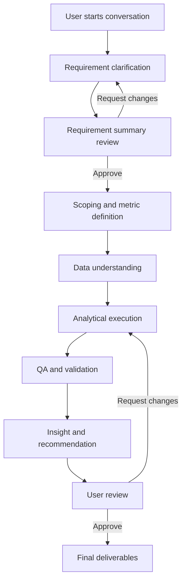
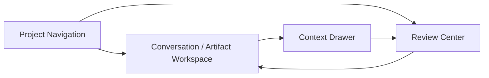
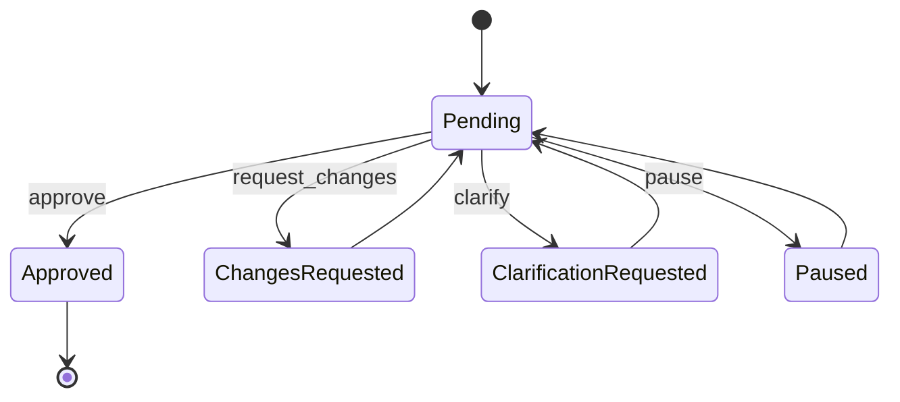

# Frontend Specification

## 1. Overview

本フロントエンドは、`backend_spec.md` で定義した multi-agent orchestration をユーザーが安全かつ直感的に利用するための対話 UI である。目的は、単に chat 入力欄を提供することではなく、要件定義、フェーズ進行、中間生成物の確認、差し戻し、承認、最終成果物の受け渡しまでを一貫して支える `human-in-the-loop workspace` を提供することである。

本 UI は、ユーザーが agent の内部動作を逐一理解しなくても、現在何が起きているか、何を確認すべきか、どの成果物がどの結論の根拠かを自然に把握できることを重視する。

## 2. Design Principles

- `Human-in-the-loop first`
  UI は chat の見た目よりも、適切なタイミングで確認・介入・承認できることを優先する。
- `Conversation plus artifacts`
  すべてを会話ログに押し込まず、会話と成果物を並列に扱う。
- `Phase-aware UX`
  現在フェーズに応じて、見るべき情報と求められる行動を変える。
- `Progressive disclosure`
  初期表示は compact にし、必要時のみ詳細を掘れるようにする。
- `Evidence-oriented UI`
  数値主張や提案には根拠 artifact への導線を必ず持たせる。
- `Policy-aware governance UX`
  policy 判定、override、QA gate、provisional mode を UI 上で区別し、通常経路と例外経路を混同させない。
- `Reviewable by default`
  中間生成物は user review 可能な単位で提示する。
- `Interruptible orchestration`
  ユーザーは pause、clarify、request_changes を安全に行える。
- `State visibility without overload`
  orchestration の状態は見えるが、生 state をそのまま見せず要約ビューで示す。
- `Desktop-first, mobile-safe`
  主作業は desktop で最適化しつつ、mobile でも review と承認は可能にする。

## 3. Product Goals

### 3.1 User Goals

- 曖昧な相談内容から分析案件を立ち上げたい
- 途中で agent の考えた中間成果物を確認したい
- 重要な場面だけ介入し、細部は自動化したい
- 最終提案がどの分析結果に基づくかを確認したい

### 3.2 Frontend Goals

- 現在の phase、進行状況、pending review を明確に見せる
- 中間生成物と会話を往復しやすくする
- Supervisor の判断結果と、その根拠 artifact を追いやすくする
- policy 判定と justified override の関係を追いやすくする
- backend の state / artifact / review contract と自然に接続する

## 4. Information Architecture

### 4.1 Core Areas

UI は大きく以下の 5 領域で構成する。

1. `Conversation Panel`
   ユーザーと system のチャット、clarification、review 応答を扱う。
2. `Project Navigation`
   phase、task、review、artifact 一覧への導線を持つ。
3. `Artifact Workspace`
   中間生成物と最終成果物を閲覧する。
4. `Review Center`
   pending review、approval、request_changes、clarify、pause を行う。
5. `Status and Provenance`
   phase progress、agent activity、根拠 artifact、decision lineage、policy / override lineage を示す。

### 4.2 Navigation Model

- project 単位の workspace を基本とする
- workspace 内で `Conversation`, `Artifacts`, `Reviews`, `Timeline`, `Deliverables` を切り替える
- current phase と pending review は常時視認できる位置に固定する

## 5. Primary User Flows

### 5.1 Project Creation Flow

1. ユーザーが課題や相談内容を chat で入力する
2. system が requirement alignment 用の確認事項を返す
3. ユーザーが追加情報を返す
4. requirement summary が生成され、review gate に入る
5. 承認後に scoping phase へ進む

### 5.2 Phase Review Flow

1. backend が review candidate artifact を生成する
2. frontend に pending review banner と review card を表示する
3. ユーザーが artifact を閲覧する
4. `approve`, `request_changes`, `clarify`, `pause` のいずれかを返す
5. backend に response を返し、timeline と conversation に反映する

### 5.3 Deliverable Inspection Flow

1. final output が生成される
2. ユーザーは summary を読む
3. 気になる主張から supporting artifact に drill-down する
4. 必要なら追加分析や修正を request する

## 6. UX Model

### 6.1 Main Workspace

メイン画面は 3 カラムを推奨する。

- 左: project navigation / phase / task / review
- 中央: conversation または selected artifact
- 右: context drawer（phase status、pending review、provenance、activity）

狭い画面では 1 カラム化し、右カラムの情報は drawer / bottom sheet に退避する。

### 6.2 UI Priority by Context

- `Requirement Alignment`
  会話中心。artifact は requirement summary が主。
- `Scoping / Metric Definition`
  document review 中心。定義シートと確認依頼を強く見せる。
- `Data Understanding / Analytical Execution`
  task progress と dataset / chart artifact の閲覧を強める。
- `Validation / QA`
  issue list、差し戻し理由、QA stage、approval 状態を中心にする。
- `Insight / Recommendation`
  narrative と supporting evidence の往復を重視する。
- `Delivery`
  executive summary、deliverables、根拠参照を重視する。

## 7. Screen Specifications

### 7.0 Shared Workspace Shell

すべての主要画面は、以下の 3 カラム shell を基本とする。

```text
+----------------------------------------------------------------------------------+
| Top Bar: Project name | phase badge | pending review count | user menu          |
+------------------------------+--------------------------------+------------------+
| Left Nav                     | Main Workspace                 | Right Context    |
| - Overview                   | - active screen content        | - current phase  |
| - Conversation               | - banners / tabs / details     | - working memory |
| - Reviews                    | - primary actions              | - focus points   |
| - Artifacts                  |                                | - blocked items  |
| - Timeline                   |                                | - access notice  |
| - Deliverables               |                                |                  |
+------------------------------+--------------------------------+------------------+
| Bottom Toast / Notification rail                                                 |
+----------------------------------------------------------------------------------+
```

原則:

- 左で移動、中央で作業、右で文脈確認
- pending review は shell レベルで常に見える
- mobile では右カラムを bottom sheet に折りたたむ

### 7.1 Project Home

表示要素:

- project title
- current phase
- overall progress
- pending reviews count
- recent activity feed
- latest deliverable summary

ユーザー行動:

- 会話を再開
- review を開く
- artifact を開く
- phase timeline を確認

rough wireframe:

```text
+----------------------------------------------------------------------------------+
| Home Header: title | phase | progress | pending reviews | latest deliverable   |
+--------------------------------------+-------------------------------+-----------+
| Current Focus Card                   | Recent Activity Feed          | Right     |
| - current phase objective            | - phase changed              | Context   |
| - top 3 focus points                 | - artifact generated         | summary   |
| - blocked items                      | - review requested           | column    |
+--------------------------------------+-------------------------------+-----------+
| Quick Links: Resume Conversation | Open Reviews | Open Artifact | View Timeline     |
+----------------------------------------------------------------------------------+
```

原則:

- 左で移動、中央で作業、右で文脈確認
- pending review は中央にも右にも出す
- provisional / risk / QA stage は artifact header で常時確認できる

### 7.2 Conversation Screen

表示要素:

- message thread
- agent-originated clarification prompts
- user responses
- inline links to related artifacts / reviews / tasks
- compose box

要件:

- backend の review request をチャット内でも通知する
- 単なるログではなく、artifact / review / decision への深掘り導線を持つ

rough wireframe:

```text
+----------------------------------------------------------------------------------+
| Conversation Header: phase | active task count | pending review badge             |
+---------------------------------------------+------------------------------------+
| Message Thread                               | Right Context                      |
| - user messages                              | - current task summary             |
| - agent clarification prompts                | - linked artifacts                 |
| - review request system cards                | - open questions                   |
| - inline artifact / decision links           | - working memory                   |
|                                              |                                    |
+---------------------------------------------+------------------------------------+
| Compose Box: message input | attach context | send                               |
+----------------------------------------------------------------------------------+
```

### 7.3 Artifact Workspace

表示要素:

- artifact title / type / phase
- summary
- rendered body
- provenance panel
- related artifacts
- QA status
- quality stage
- provisional / final indicator
- access scope notice

artifact renderer は少なくとも以下をサポートする。

- document
- table preview
- chart gallery
- issue list
- report outline
- JSON / schema view

rough wireframe:

```text
+----------------------------------------------------------------------------------+
| Artifact Header: title | type | phase | QA status | quality stage | provisional  |
+----------------------------------------+-----------------------------------------+
| Summary Pane                           | Provenance / Metadata                   |
| - summary                              | - producer / task / updated_at          |
| - business meaning                     | - upstream / downstream                 |
| - access notice                        | - data snapshot / tags                  |
+----------------------------------------+-----------------------------------------+
| Rendered Body                                                                    |
| - document / table / chart / issue list / report outline / JSON                 |
+----------------------------------------------------------------------------------+
```

### 7.4 Review Center

表示要素:

- pending review list
- selected review detail
- associated artifacts
- blocking scope
- impact summary
- required action buttons
- comments input

アクション:

- `approve`
- `request_changes`
- `clarify`
- `pause`

rough wireframe:

```text
+----------------------------------------------------------------------------------+
| Review Header: pending count | blocking scope | urgency                           |
+------------------------------+--------------------------------+------------------+
| Pending Review List          | Selected Review Detail         | Related Artifacts|
| - review title               | - prompt to user               | - artifact A     |
| - phase                      | - impact summary               | - artifact B     |
| - requested by               | - allowed actions              | - QA status      |
| - due / waiting time         | - comments box                 | - provenance     |
+------------------------------+--------------------------------+------------------+
| Action Bar: approve | request_changes | clarify | pause                          |
+----------------------------------------------------------------------------------+
```

### 7.5 Timeline / Activity Screen

表示要素:

- phase transitions
- supervisor decisions
- policy decisions
- justified override events
- advisor consult events
- major task completions
- plan approval events
- QA events
- user review events

目的:

- 「何がいつ起きたか」を後から追えるようにする

rough wireframe:

```text
+----------------------------------------------------------------------------------+
| Timeline Header: filters | phase | actor | event type                            |
+---------------------------------------------+------------------------------------+
| Event Stream                                 | Event Detail / Evidence            |
| - phase changed                              | - full event summary               |
| - plan approved                              | - linked decision / artifact       |
| - QA rejected                                | - policy version                   |
| - advisor consulted                          | - override reason                  |
| - user review responded                      | - timestamps / trace ids           |
+---------------------------------------------+------------------------------------+
```

### 7.6 Deliverables Screen

表示要素:

- executive summary
- final outputs
- supporting artifacts
- sign-off status
- provisional outputs separated from final outputs

rough wireframe:

```text
+----------------------------------------------------------------------------------+
| Deliverables Header: project | sign-off status | final delivery readiness          |
+----------------------------------------+-----------------------------------------+
| Executive Summary                        | Final Outputs                         |
| - key findings                           | - report deck                         |
| - top recommendations                    | - appendix package                    |
| - major caveats                          | - export / sign-off actions           |
+----------------------------------------+-----------------------------------------+
| Supporting Evidence                                                              |
| - supporting artifacts list                                                    |
| - provisional outputs listed separately and visually muted                      |
+----------------------------------------------------------------------------------+
```

## 8. Human-in-the-Loop Interaction Design

### 8.1 Review Presentation Policy

review request は単に modal で出すのではなく、以下の 3 箇所に一貫して出す。

- global pending review banner
- conversation thread 内の system message
- review center 内の actionable card

### 8.2 Required User Actions

ユーザーは以下を UI から返せる必要がある。

- `approve`
- `request_changes`
- `clarify`
- `pause`

必要なら以下も将来的に追加可能とする。

- `approve_with_comment`
- `approve_partial_scope`
- `delegate_to_team_member`

### 8.3 Review UX Requirements

- artifact を読まずに approve しにくい UI にする
- どの artifact を確認すべきかを明示する
- request_changes ではコメント記入を促す
- clarify は追加質問を簡潔に返せるようにする
- pause は影響範囲を見せたうえで実行できるようにする
- policy override が関係する場合、通常経路ではないことを明示する

## 9. Intermediate Artifact UX

### 9.1 User-Facing Artifact Types

- requirement summary
- project scope memo
- metric definition sheet
- data understanding summary
- exploratory findings summary
- QA issue summary
- insight memo
- recommendation outline
- final report

### 9.2 Artifact Display Rules

- summary を先に見せる
- 詳細本文は fold / tab / drill-down で開く
- artifact ごとに `phase`, `producer`, `QA status`, `updated_at` を表示する
- artifact ごとに `quality_stage`, `risk_level` があれば表示する
- supporting evidence への導線を常に持つ
- `draft`, `QA-approved`, `final-delivery` を視覚的に区別する

### 9.3 Evidence UX

数値主張を含む UI 要素には以下の導線を必須とする。

- source artifact link
- cited region / section 表示
- related QA status
- provisional かどうかの表示

## 10. Frontend State Model

frontend state は backend state の mirror ではなく、UI 表示に必要な projection とする。

### 10.1 Frontend State Domains

- `session state`
  authentication、tenant、active project
- `workspace state`
  selected phase、selected artifact、selected review、open panels
- `conversation state`
  messages、draft input、pending send
- `review state`
  pending reviews、review forms、submission status
- `artifact state`
  artifact summaries、loaded bodies、renderer state
- `live status state`
  current phase、active tasks、notifications、progress
- `governance state`
  risk evaluations、approval routing results、override records、advisor consult records
- `memory state`
  working memory summary、provisional assumptions、current focus

### 10.2 Sync Strategy

- backend の `summary views` を frontend の主要表示に使う
- artifact 本文は lazy load する
- task / review / phase 更新は polling または stream で反映する
- heavy execution の進行は progress summary として表示し、生 state は出しすぎない
- access 制約がある field は masked または unavailable として表示し、欠落を補完しない
- frontend は full episodic memory を表示しなくてよく、working memory の要約と current focus だけを status / governance 領域で表示すればよい

## 11. Frontend-Backend Contracts

### 11.1 Required API Domains

- `projects`
- `conversation`
- `reviews`
- `artifacts`
- `timeline`
- `status`
- `governance`

### 11.2 Minimal API Responsibilities

- project 一覧取得
- project summary 取得
- conversation message 送受信
- pending reviews 取得
- review response 送信
- artifact summary / detail 取得
- timeline event 取得
- live status summary 取得
- risk / readiness / override / advisor consult の governance summary 取得

### 11.3 Artifact and Governance Projection Contract

frontend は backend の生 state をそのまま受け取るのではなく、少なくとも以下の projection を受け取れることを前提とする。

- artifact summary
  `artifact_id`, `artifact_type`, `phase`, `summary`, `qa_status`, `quality_stage`, `visibility`, `provisional`, `updated_at`
- governance summary
  `risk_level`, `readiness_decision`, `policy_version`, `decision_actor`, `decision_basis`, `override_level`, `override_reason_type`, `advisor_consulted`
- access summary
  `allowed`, `masked_fields`, `access_notice`
- memory summary
  `working_memory_summary`, `focus_points`, `blocked_items`, `provisional_assumptions`

### 11.4 Review API Contract

frontend は backend の `UserReviewRequest` と `UserInteractionRecord` に準拠する。

request 例:

```json
{
  "review_id": "review_005",
  "phase": "scoping_and_metric_definition",
  "artifact_ids": ["artifact_017"],
  "prompt_to_user": "Please confirm whether these metric definitions match your business interpretation.",
  "allowed_actions": ["approve", "request_changes", "clarify", "pause"],
  "blocking_scope": "phase",
  "deadline": null
}
```

response 例:

```json
{
  "review_id": "review_005",
  "action": "request_changes",
  "comments": "Active user should exclude internal staff accounts.",
  "requested_changes": ["Revise active user definition"],
  "approved_scope": []
}
```

### 11.5 Endpoint Catalog

frontend が利用する API の概観を以下に定義する。実装着手後は OpenAPI が物理的正本となるが、論理的な責務分割は本節を正本とする。

#### 11.5.1 Auth

| Method | Path | Responsibility |
|---|---|---|
| POST | `/auth/session` | Auth.js callback、session 確立 |
| GET | `/auth/me` | 自分の認証情報取得 |
| POST | `/auth/logout` | session 破棄 |

#### 11.5.2 Projects

| Method | Path | Responsibility | Mock source |
|---|---|---|---|
| GET | `/projects` | プロジェクト一覧 | `projects.list` |
| POST | `/projects` | プロジェクト新規作成 | — |
| GET | `/projects/{project_id}` | プロジェクトサマリ | `projects.summary` |
| PATCH | `/projects/{project_id}` | プロジェクト更新 | — |
| DELETE | `/projects/{project_id}` | プロジェクト archive | — |

#### 11.5.3 Workspace Status

| Method | Path | Responsibility | Mock source |
|---|---|---|---|
| GET | `/projects/{project_id}/status` | 現フェーズ・active task・pending review | `workspace.status` |
| GET | `/projects/{project_id}/governance` | risk / readiness / override / consult サマリ | governance projection |
| GET | `/projects/{project_id}/memory` | working memory + focus | memory projection |

#### 11.5.4 Conversation

| Method | Path | Responsibility | Mock source |
|---|---|---|---|
| GET | `/projects/{project_id}/conversation` | message thread 取得 | `workspace.conversation` |
| POST | `/projects/{project_id}/conversation` | ユーザーメッセージ送信 | — |
| GET | `/projects/{project_id}/stream` | SSE: graph 進行イベント配信 | — |

#### 11.5.5 Reviews

| Method | Path | Responsibility | Mock source |
|---|---|---|---|
| GET | `/projects/{project_id}/reviews` | pending review 一覧 | `reviews.pending` |
| GET | `/reviews/{review_id}` | review 詳細 | review detail projection |
| POST | `/reviews/{review_id}/respond` | review への応答 | `reviews.response_example` |

#### 11.5.6 Artifacts

| Method | Path | Responsibility | Mock source |
|---|---|---|---|
| GET | `/projects/{project_id}/artifacts` | artifact 一覧 | `artifacts.list` |
| GET | `/artifacts/{artifact_id}` | artifact summary | artifact projection |
| GET | `/artifacts/{artifact_id}/body` | artifact 本体 lazy load | — |
| GET | `/artifacts/{artifact_id}/lineage` | upstream / downstream | — |

#### 11.5.7 Timeline and Deliverables

| Method | Path | Responsibility | Mock source |
|---|---|---|---|
| GET | `/projects/{project_id}/timeline` | event log | timeline events |
| GET | `/projects/{project_id}/deliverables` | final outputs 一覧 | deliverables projection |
| POST | `/projects/{project_id}/deliverables/{output_id}/signoff` | サインオフ | — |

#### 11.5.8 Admin

| Method | Path | Responsibility |
|---|---|---|
| GET | `/admin/tenants` | テナント一覧(super admin) |
| POST | `/admin/tenants` | テナント作成 |
| PATCH | `/admin/tenants/{tenant_id}` | テナント設定更新(LLM provider 等) |
| GET | `/admin/tenants/{tenant_id}/usage` | usage / cost サマリ |

### 11.6 HTTP Contract Conventions

- 全 endpoint は `Authorization: Bearer <jwt>` を要求する(`/auth/*` を除く)
- JWT は Auth.js から発行され、tenant 解決は JWT claim の `tenant_id` を backend dependency で検証する
- list 系 endpoint は `?cursor=<opaque>&limit=<int, default=50, max=200>` を受ける
- list response は `{ "items": [...], "next_cursor": "<opaque or null>" }` を共通形とする
- v1 prefix は MVP では必須としないが、互換性破壊時に `/v2/*` を追加できる構成にする

### 11.7 Error Response Contract

```json
{
  "ok": false,
  "error_type": "validation_error",
  "message": "Active user definition is missing exclusion criteria",
  "trace_id": "0123abc..."
}
```

`error_type` は少なくとも以下を持つ。

- `validation_error`
- `auth_error`
- `not_found`
- `policy_violation`
- `tool_error`
- `internal`

## 12. Real-Time and Refresh Model

### 12.1 Update Strategy

以下のいずれか、または組み合わせを採用する。

- short polling
- server-sent events
- websocket

### 12.2 Event Types

- new conversation message
- phase changed
- review requested
- review responded
- approval routed
- override recorded
- advisor consulted
- task completed
- artifact generated
- deliverable ready

### 12.2.1 SSE Event Schema Examples

`/projects/{project_id}/stream` は EventSource API で購読し、LangGraph の `astream_events` を正規化して配信する。

```text
event: message
data: {"type":"agent_started","agent_name":"sql_specialist","task_id":"task_034"}

event: message
data: {"type":"tool_call_started","tool_name":"validate_sql","task_id":"task_034"}

event: message
data: {"type":"artifact_created","artifact_id":"artifact_017","artifact_type":"execution_plan"}

event: message
data: {"type":"plan_decision","decision":"approve","decision_actor":"supervisor","task_id":"task_034"}

event: message
data: {"type":"review_requested","review_id":"review_011"}

event: message
data: {"type":"phase_changed","from_phase":"data_understanding","to_phase":"analytical_execution"}

event: message
data: {"type":"task_completed","task_id":"task_034"}

event: message
data: {"type":"deliverable_ready","output_id":"output_001"}
```

正規化 Literal 集合は backend schema と codegen で同期する。

### 12.3 Notification Policy

- pending review は高優先で通知する
- background task 完了は控えめに通知する
- repeated failures は warning として通知する
- provisional mode 開始と justified override は warning 相当で通知する

## 13. Mermaid Diagrams

### 13.1 UX Flow



### 13.2 Workspace Layout



### 13.3 Review Lifecycle



## 14. Design System and Visual Language

### 14.1 Visual Direction

- clean and analytical
- document-centric rather than chat-only
- high information density without clutter
- strong hierarchy for review-required states
- clear separation between normal path and exception path

### 14.2 Core UI Tokens

- phase colors
- QA status colors
- quality stage colors
- risk level colors
- review urgency colors
- artifact type icons
- consistent spacing and type scale

### 14.3 Motion

- phase transition highlight
- subtle artifact loading transitions
- clear emphasis on newly arrived review requests

## 15. Accessibility and Usability

### 15.1 Accessibility Requirements

- keyboard navigable
- sufficient color contrast
- screen-reader friendly review actions
- clear focus states
- non-color-only status signaling

### 15.2 Usability Requirements

- user should understand current phase within 3 seconds
- pending review should be discoverable without scrolling through the whole chat
- final claim should be traceable to evidence within 2 clicks

## 16. Responsive Behavior

- desktop: 3-column workspace
- tablet: 2-column with collapsible context drawer
- mobile: single-column flow with bottom sheet for reviews and context

mobile では full analysis workbench より、review / approval / status tracking を優先する。

## 17. Frontend Observability

frontend 側でも少なくとも以下を観測する。

- review open rate
- review completion rate
- time-to-first-response
- artifact open rate
- citation click-through rate
- phase confusion indicators
- failed action submissions
- override detail open rate
- provisional artifact open rate

## 18. Open Questions for Future Iteration

- 複数ユーザー同時編集を最初から考慮するか
- artifact annotation を UI 上で許可するか
- chart や table への inline comment を導入するか
- mobile でどこまで artifact detail を開けるようにするか

## 19. Initial Implementation Priorities

1. project workspace shell
2. conversation screen
3. review center
4. artifact workspace
5. live phase / status display
6. deliverables screen
7. timeline / provenance screen
